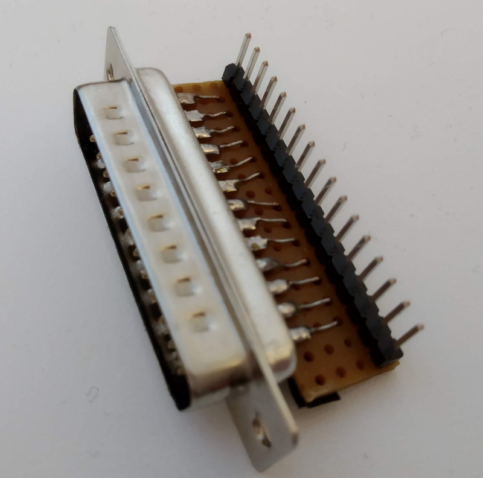
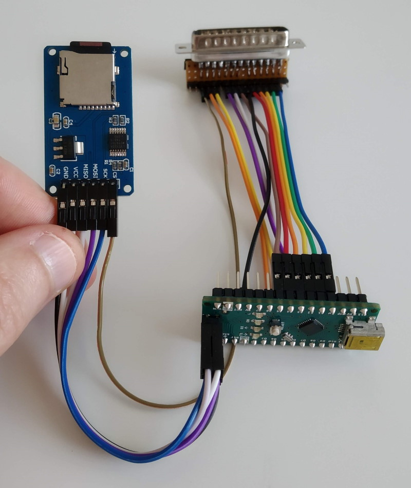
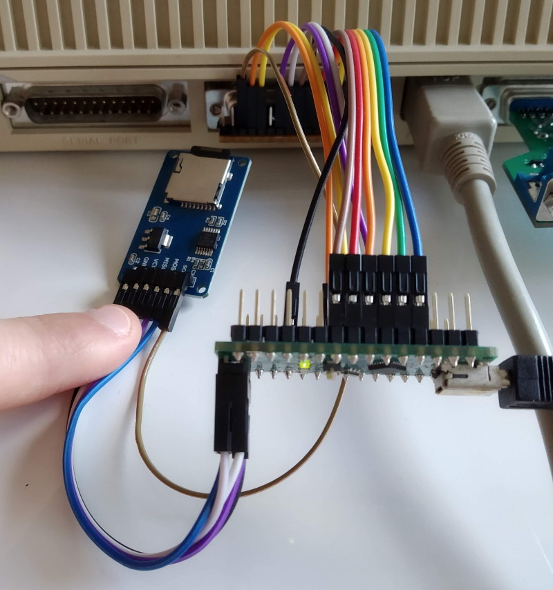
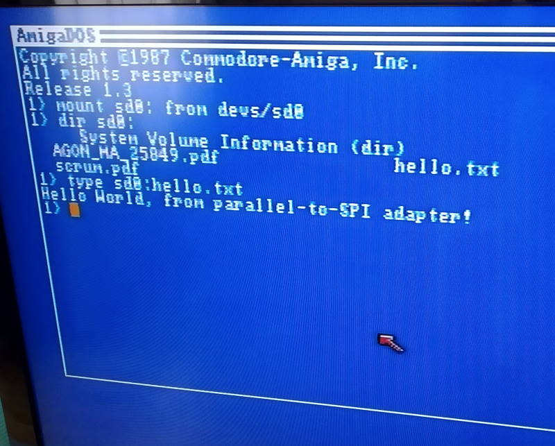

# Amiga Parallel Port to SPI Adapter

The goal of this project is to make a cheap and easy to build SPI adapter that connects to the parallel port of an Amiga. Furthermore, the performance of the adapter should be as fast as possible.

## What parts make up the project?

- An AVR microcontroller, provided by an Arduino Nano board
- A parallel port connector that connects to the AVR
- [Instructions](hardware/assembly-instructions.md) for how to assemble the above
- [Code](avr) for the AVR that waits to receive commands from the Amiga, and executes those commands
- A source code library for the Amiga, [*spi-lib*](spi-lib), that communicates with the AVR
- An [example](examples/spisd) of how to use the adapter to connect to an SD card module

|         |            |
| ------------- |---------------|
|  |  |
| |  |

See the [assembly instructions](hardware/assembly-instructions.md) for how to connect the parts together.

## What can it be used for?

There exists many SPI peripherals that can be connected to this adapter.
The SPI adapter comes with a source code library, spi-lib, that is used to perform reads and writes to the SPI peripheral.
For each kind of SPI peripheral, however, a separate driver needs to be written that uses spi-lib, and exposes the functionality of the SPI peripheral to the operating system using some suitable interface.

In the directory [examples/spisd](examples/spisd) an example of how an SD card module can be connected to the SPI adapter, and a driver is provided that lets AmigaOS mount the SPI card as a file system.

## Performance

The throughput of the adapter is limited by how fast the 68k CPU can access the CIA chips.
The CPU can make one access (a read or a write) to a CIA chip per E-cycle.
An E-cycle is one tenth of the frequency of an original Amiga.
The E-cycle frequency is thus roughly 700 kHz, regardless if the Amiga uses an accelerator or not.
The protocol used by the SPI adapter can communicate one byte every two E-cycles which gives a theoretical upper
limit of 350 kB/s.

I performed a simple benchmark on an A500 with an HC508 accelerator, and an SD card module connected to the SPI adapter.
Copying a 23 MB file from the SD card to the compact flash in the HC508 took 98 seconds, giving a throughput of 225 kB/s.
I think this is a good result, and I believe it will be hard to come much closer to the theoretical limit of 350 kB/s.

There are however some optimizations that could be implemented, such as transfering more than one sector (512 bytes) at a time from the SD card, that could make the throughput come closer to the limit.
